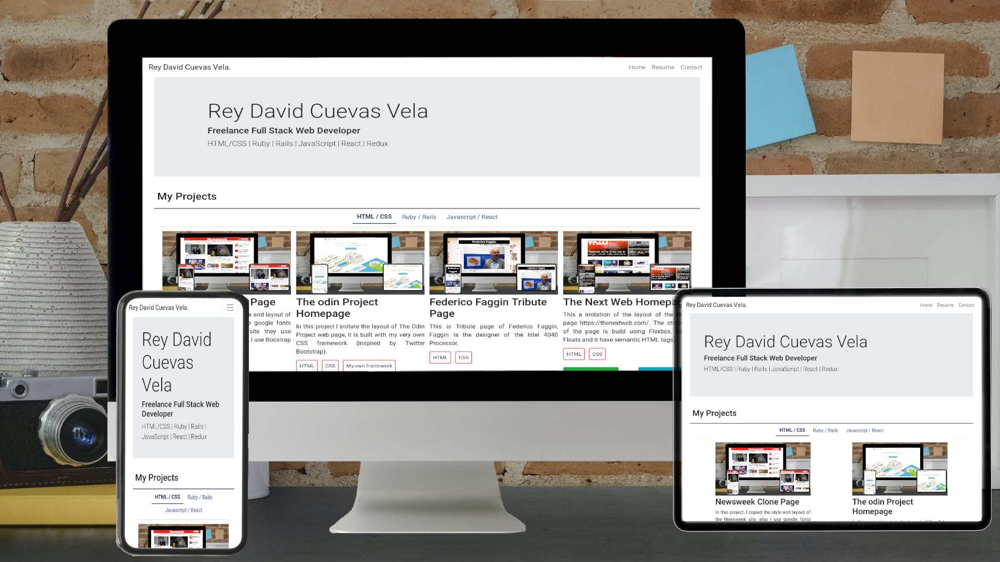

<!-- Badges -->
<p>
  
  <a href="#" target="_blank">
    
  </a>
  <a href="https://twitter.com/redacuve" target="_blank">
    
  </a>
</p>


<!-- Project Header -->
  <p align="center">
    
  <br>
  <h1 align="center">Project My Portfolio</h1>
  <p align="center">
  <br>
   <a href="https://github.com/redacuve/my-portfolio"><strong>Explore the repo »</strong></a>
  <br>
    <a href="https://github.com/redacuve/my-portfolio/issues">Request Feature</a>
  </p>
  <h2 align="center"><a href="https://redacuve.github.io/my-portfolio/"><strong>Live Link!</strong></a></h2>

<!-- TABLE OF CONTENTS -->

## Table of Contents

* [About the Project](#about-the-project)

* [Built With](#built-with)

* [Getting Started](#getting-started)

* [How it Works](#how-it-works)

* [Contributing](#contributing)

* [License](#license)

* [Contact](#contact)

* [Acknowledgements](#acknowledgements)

<!-- ABOUT THE PROJECT -->

## About The Project

This is my web Page, here you can find my resume and my portfolio. this web app is built completely with REACT, also is responsive, you can check it live.

Go to: <a href="https://redacuve.github.io/my-portfolio/" target="_blank">https://redacuve.github.io/my-portfolio/</a>


### Built With

* [React](https://reactjs.org/docs/getting-started.html)

* [HTML5](https://developer.mozilla.org/es/docs/HTML/HTML5)

* [CSS](https://developer.mozilla.org/es/docs/Web/CSS)

* React Packages used:
    * [react-fontawesome](https://github.com/FortAwesome/react-fontawesome)
    * [react-bootstrap](https://react-bootstrap.github.io/)
    * [react-router](https://reacttraining.com/react-router/web/guides/quick-start)
    * [gh-pages](https://www.npmjs.com/package/gh-pages)

* Deployed with
    * [GitHubPages](https://pages.github.com/)
<!-- GETTING STARTED -->

## Getting Started

To get a local copy up and running follow these simple steps.

Clone or fork the <a href="https://github.com/redacuve/my-portfolio">repo</a> [git@github.com:redacuve/my-portfolio.git]

*note you need have install npm or yarn
* [npm](https://www.npmjs.com/get-npm)
* [yarn](https://classic.yarnpkg.com/en/docs/install)


<!-- HOW IT WORKS -->
## How it Works

It is built with react, inside the src folder is everything, index.js is the main file, it uses the index.html located inside the public folder, inside src are three folders, one folder contains the assets of the page (images), the pages folder has 3 pages inside Homepage, Contacpage, and Resumepage, and the components are located inside components folder, I created that components to be easy to maintain, feel free to take any of the components.

### Running the code

*   Navigate to the root directory of the project

*   Run this command on your terminal to run the code locally on http://localhost:3000:
    ```
    $ npm start
    ```
*   Also you can build this app for production, react are going to make a build folder with minified files, and filenames with hashes for best performance
    ```
    $ npm build
    ```
*   You can learn more in the [Create React App documentation](https://facebook.github.io/create-react-app/docs/getting-started).

* To learn React, check out the [React documentation](https://reactjs.org/).

<!-- CONTRIBUTING -->

## Contributing

Contributions are what make the open source community such an amazing place to be learn, inspire, and create. Any contributions you make are **greatly appreciated**.

1. Fork the Project

2. Create your Feature Branch (`git checkout -b feature/AmazingFeature`)

3. Commit your Changes (`git commit -m 'Add some AmazingFeature'`)

4. Push to the Branch (`git push origin feature/AmazingFeature`)

5. Open a Pull Request

<!-- LICENSE -->

## License

This project is under the <a href="https://www.gnu.org/licenses/gpl-3.0.html">GNU Public License V3</a>. For more information see <a href="https://github.com/redacuve/my-portfolio/blob/master/LICENSE">here</a>

<!-- CONTACT -->

## Contact

Rey David Cuevas Vela - [@redacuve](https://twitter.com/redacuve) - redacuve@gmail.com -[linkedin.com/in/redacuve/](https://www.linkedin.com/in/redacuve/)

Project Link: [github.com/redacuve/my-portfolio](https://github.com/redacuve/my-portfolio) - Portfolio Project.

<!-- ACKNOWLEDGEMENTS -->

## Acknowledgements

* [Rey David Cuevas Vela](https://github.com/redacuve)
